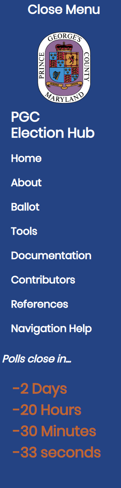
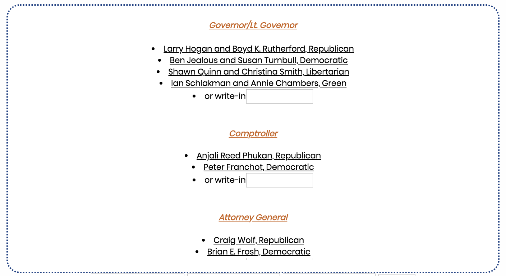
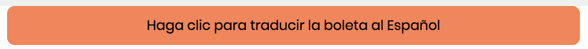
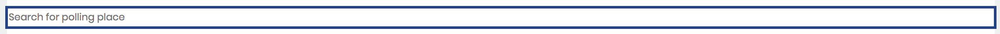
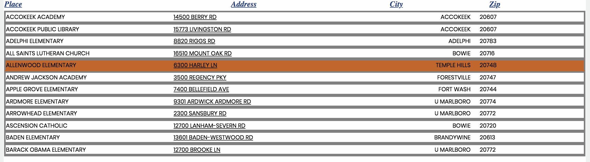
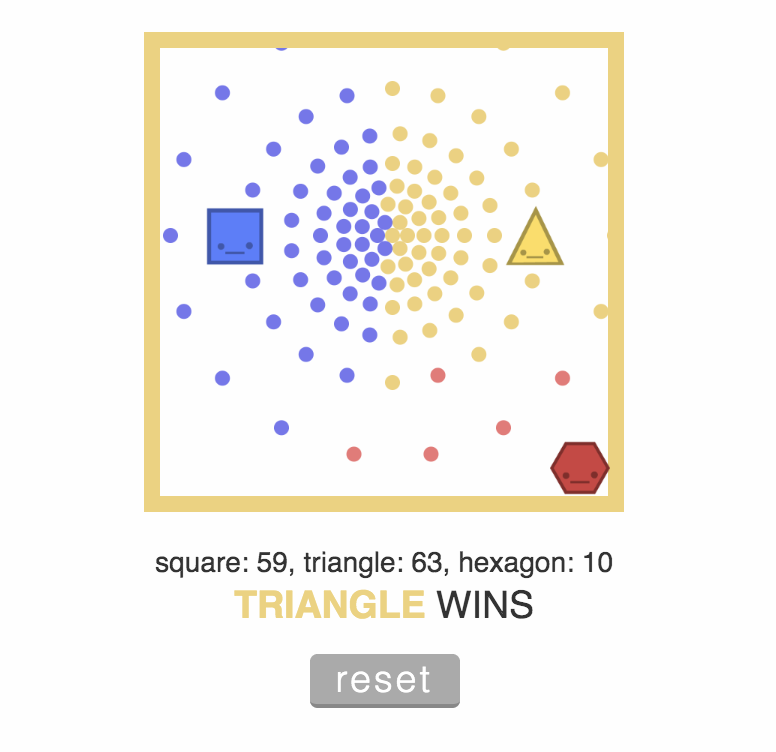
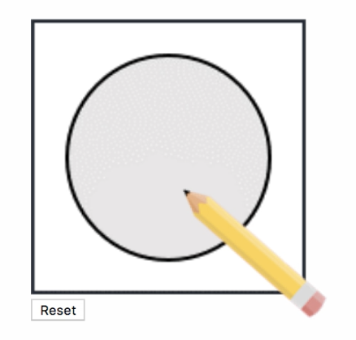

 <!--Documentaiton-->
  # Documentation 
##
# User Manual #
This resource was created in order to aid in the process of informing inexperienced and uneducated voters about the voting process. Here, you can find a guide to the different parts of the website, that will help orient you. Here are the specific functionalities you will see on the site:
     
1. Navigation Bar
2. Ballot Candidate Table
3. Translation Button
4. Search Bar
5. Polling Places List
6. Vote Count Simulator
7. Ballot Bubble Simulator

#
## Navigation Bar ##

The navigation bar serves to help you find your way around the site. You will see there are four sections to our navigation bar. These sections are home, about, ballot, and documentation. Clicking "Home" will take you to the top of our page. Clicking "About" will take you to the about section of our website. This section will give you a better idea of what our website's purpose is and who it is meant for. Clicking "Ballot" will take you to the section of our website that holds all the main functionalities of our website. You will be able to scroll through and find the ballot candidate table, the translation button, the search bar, the polling places list, the vote count simulator, and the ballot bubble simulator. Finally, clicking "Documentation" will take you to the part of our website with any instructions one would need to use the site.
#
## Ballot Candidate Table ##

In the Ballot Candidate table, you will find all of the candidates running for office, as they would appear in the ballot. You will also see their political party. You will see that they are separated by the position that there are running for. You can scroll within this box the same as you would for any page. You can click on some of the elements in this box for more resources. For instance, you can click on the position title, for information about what that position is and what they do. You can also click on any candidate to navigate to that candidate's page. You will also see a write in input box in this section. This is meant to appear as it would on a real ballot, but it is not meant to be submitted. At this point in time, link functionality is not in place for the Spanish version of the ballot. All ballot data contained on this site reflects the 2018 Gubernatorial Ballot in the state of Maryland.
#
## Translation Button ##

The translation button allows you to see the candidate table in spanish. This functionality is quite simple. You will see a button over the ballot candidate table with the prompt, "Haga clic para traducir la boleta al Español." Clicking this will allow you to see all of the candidates and titles in spanish. Once translated to Spanish, the button will appear with the text, "Click to translate ballot to English"; once clicked the ballot will revert to the English version.
#
## Search Bar ##

The search bar is meant to search through all of the polling places in Prince George's County. If you know of a polling place in the county, you can type it in to the search bar, and it will display all of the relevant places in the search. If what you type in does not match a polling place on the list, nothing will show up.
#
## Polling Places List ##

The polling place lists all of the polling places available in Prince George's county. Each place has a District/Precinct number, location name, Address, City, Zip Code, and number of Ballots. As seen previously, the polling places are searchable through the search bar above. Additionally, the list is filterable. Clicking any of the headings at the top of the list will give you a different filter. Clicking "Dist/Prec" will list all of the places based on the district and precinct. Clicking "Polling Place" will sort all of the places by name alphabetically. Clicking "Address" will sort everything by address. Cicking city will sort all places by city. Clicking by Zip will sort all polling places by zip code. Finally, clicking ballot will sort places by number of ballots.
#
## Vote Count Simulator ##

The Voting Count Simulator is a resource that is publically provided by ncase and company. This resource allows you to play arounf and illustrate how a candidate wins an election over other candidates. As you move the different shapes around, you will find that their respective colors will cover different areas of the square. The area covered by colors simulates how many votes a candidate has. You will be able to see a numerical representation of this at the bottom. This will illustrate that the candidate who has the most color, or most votes, will win.
#
## Ballot Bubble Simulator ##

The Ballot Bubble Simulator is meant to practice filling in the bubbles that you will find when voting. As you hold your screen over the box, you will see a pencil appear. You can hold down the mouse and drag through the box to fill in the inner circle. If you fill in correctly, the box will turn green. If you overfill or underfill, the box will turn red. You can reset the box by pressing the reset button located to the right of the box.

